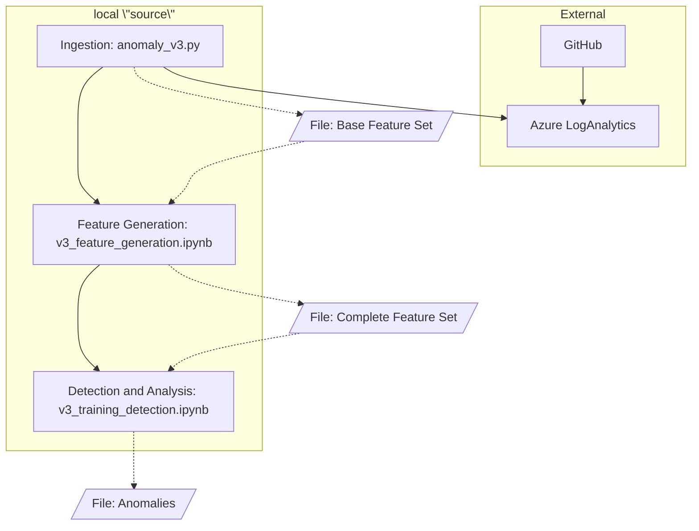

# Security Anomaly Detection Enterprise GitHub

The technology to identify security anomalies in enterprise DevSecOps platforms, such as misuse/abuse, risky behaviors, misconfigurations, and malicious actions. This is provided under the BSD-3 license and supporting commercial & academic research.

*Published and presented at IEEE SecDev 2025: User Entity Behavior Analytics (UEBA) Enhanced Security Anomaly Detection in Enterprise DevSecOps Platforms (link to be added after publication)*

This source and notebooks can be used to detect anomalies when using in conjunction with Azure LogAnalytics, where the logs are housed. This leverages KQL functions in LogAnalytics to generate the base features with high speed, which then only the required subset is ingested for further processing.



## Setup

### Azure LogAnalytics

Configuration of the KQL functions in Azure is a prerequisite to any of the local code. These are configured as Functions in LogAnalytics, where *starttime* and *endtime* are variables configurable to identify the date range to process.

It is **likely** that you need to change table names to match your deployment, but column names should be the same using a standard configuration.

1. [fGHAuditActorRepoUse](kql-functions/fGHAuditActorRepoUse.kql)
2. [fGHAuditRepoUse](kql-functions/fGHAuditRepoUse.kql)
3. [fGHAuditActorStats](kql-functions/fGHAuditActorStats.kql)
4. [fGHAuditMLFeatures](kql-functions/fGHAuditMLFeatures.kql)

All queries can be tested in conjunction with one another by testing the call to fGHAuditMLFeatures, which subsequently calls all other functions. This should results in a table, group by users, with all machine learning features.

### Local

The machine where ingestion will be performed, training, and analysis required a few setup steps.

**Python environment**

You will use Python and Python notebooks to run the solution. This requires running

```pip3 install -r requirements```

to ensure all dependencies are installed.

**Login to Azure**

Use the Azure CLI to set the login for the environment. The easiest way to do this is using

```az login```

Check the [documentation](https://learn.microsoft.com/en-us/cli/azure/authenticate-azure-cli-interactively?view=azure-cli-latest) for more details.

**Create Environment File**

A local .env file contains the Azure Workspace ID to connect to for the LogAnalytics instance. It should contain this text, replacing with your workspace ID (usually formatted as aaaaaaaa-aaaa-aaaa-aaaa-aaaaaaaaaaaa).

```
AZ_WORKSPACE_ID=<your-workspace-id>
```

## Running

1. Execute anomaly_execution.py with a parameter of "ingest"

```python3 anomaly_execution.py ingest```

This will pull the last 188 days of data using the KQL query gGHAuditMLFeatures in Azure to a local file (e.g., data/v3-ml-features-20250727.csv).

2. Run notebook feature_generation.ipynb

Open this notebook and modify the file names in the first cell as needed. Execute the entire notebook. This will generate a new file that contains the complete training & analysis set (e.g., data/v3-ml-complete-features-20250727.csv).

3. Run notebook detection_analysis.ipynb

Open this notebook and modify the file names in the first cell as needed. Execute the entire notebook. This will training, analyze, and generate the anomalies for your dataset- visible as results in the notebook.
