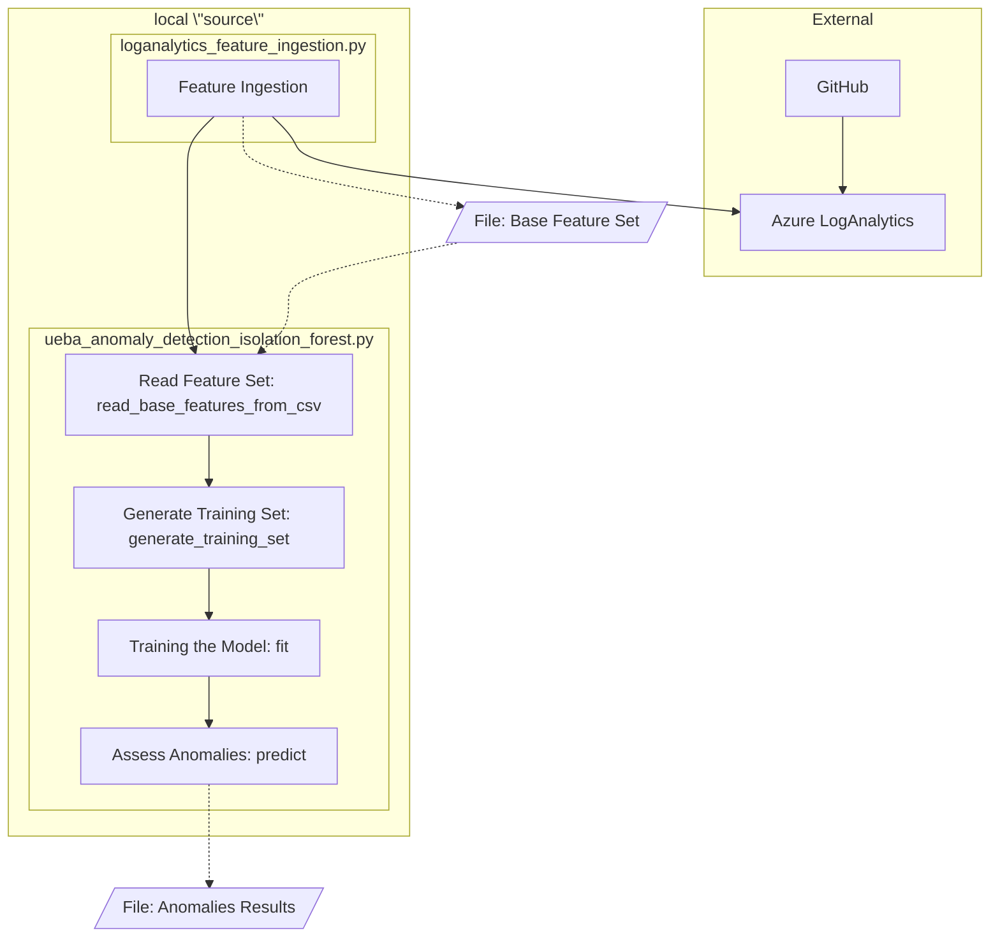

# Security Anomaly Detection Enterprise GitHub

*Update January, 2026: The implementation of anomaly detection has changed from notebooks to proper Python modules that are more easily utilized for testing & deployment. The algorithm has also been enhanced to better split test/training sets and ensure a rolling history is used in z-score calculations.*

The technology to identify security anomalies in enterprise DevSecOps platforms, such as misuse/abuse, risky behaviors, misconfigurations, and malicious actions. This is provided under the BSD-3 license and supporting commercial & academic research.

*Published and presented at IEEE SecDev 2025: [User Entity Behavior Analytics (UEBA) Enhanced Security Anomaly Detection in Enterprise DevSecOps Platforms](https://doi.org/10.1109/SecDev66745.2025.00021)*

This source can be used to detect anomalies when using in conjunction with Azure LogAnalytics, where the logs are housed. This leverages KQL functions in LogAnalytics to generate the base features with high speed, which then only the required subset is ingested for further processing.



## Setup

### Azure LogAnalytics

Configuration of the KQL functions in Azure is a prerequisite to any of the local code. These are configured as Functions in LogAnalytics, where *starttime* and *endtime* are variables configurable to identify the date range to process.

It is **likely** that you need to change table names to match your deployment, but column names should be the same using a standard configuration.

1. [fGHAuditActorRepoUse](kql-functions/fGHAuditActorRepoUse.kql)
2. [fGHAuditRepoUse](kql-functions/fGHAuditRepoUse.kql)
3. [fGHAuditActorStats](kql-functions/fGHAuditActorStats.kql)
4. [fGHAuditMLFeatures](kql-functions/fGHAuditMLFeatures.kql)

All queries can be tested in conjunction with one another by testing the call to fGHAuditMLFeatures, which subsequently calls all other functions. This should results in a table, group by users, with all machine learning features.

### Local

The machine where ingestion will be performed, training, and analysis required a few setup steps.

**Python environment**

You will use Python to run the solution. This requires running

```pip3 install -r requirements```

to ensure all dependencies are installed.

**Login to Azure**

Use the Azure CLI to set the login for the environment. The easiest way to do this is using

```az login```

Check the [documentation](https://learn.microsoft.com/en-us/cli/azure/authenticate-azure-cli-interactively?view=azure-cli-latest) for more details.

**Create Environment File**

Create a local `.env` file by copying the provided `.env.example` template:

```bash
cp .env.example .env
```

Then edit `.env` to add your Azure Workspace ID and other required credentials. The workspace ID is usually formatted as `aaaaaaaa-aaaa-aaaa-aaaa-aaaaaaaaaaaa`.

*Note: The `.env` file is git-ignored to protect your credentials from being committed to the repository.*

## Running

1. Execute anomaly_execution.py. This will by default store a file in the 'data' folder with today's date. Modify the 'main' method for redirection of the file context to be stored in another location.

```python
# run the ingestion from Log Analytics for the last 181 days (give a one day buffer for partial day)
python3 ingestion/loganalytics_feature_ingestion.py
```

This will pull the last 181 days of data using the KQL query fGHAuditMLFeatures in Azure to a local file (e.g., data/v3-ml-features-20250727.csv).

2. Extract features, extend, and train the model

Using ueba_anomaly_detection_isolation_forest.py, the feature set can be imported, enriched with expanded features, and the model trained. The class is defined to use the tuned parameters from the latest paper, but can be modified in the \_\_init\_\_ if needed.

```python
# create the detector
ueba = UEBAAnomalyDetector()

# read the features from the file generated in the previous step
df_base = ueba.read_base_features_from_csv(get_file_path())

# enrich and extract the set of data to be used for model training, defined by the history percentage
df_train = ueba.generate_training_set(df_base, history_perc=0.7)

# train the model
ueba.fit(df_train)
```

*Note: Several of these methods allow exporting of the dataset or model at each step via an additional method parameter.*

3. Detect anomalies

Run the detection to predict the anomalies.

```python
df_results = ueba.predict(df_predictdata, day)
```

